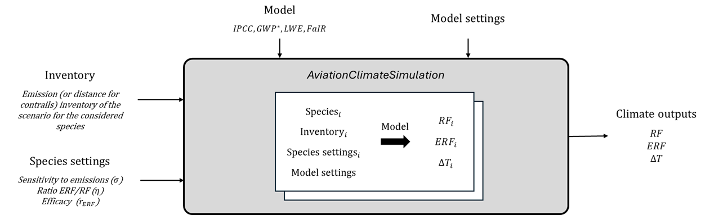
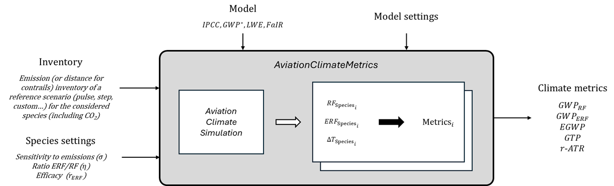

# Overview

## Run a climate simulation

The following figure corresponds to the process for using standardised aviation climate models, using the *AviationClimateSimulation* class.

The climate outputs available are RF, ERF and surface temperature change ($\Delta T$). The current process allows for the inclusion of the following species: CO2, contrail cirrus, NOx (via short-term ozone increase, and via long-term methane loss and induced effects), water vapour, aerosol-radiation interactions from soot emissions, and aerosol-radiation interactions from sulphur emissions. Note that the framework could easily be adapted to integrate new species, such as aerosol-cloud interactions from soot or sulphur emissions. 

An emission inventory is needed for the considered species. In the case of contrails, the decision was made to use an indicator based on 2018 flight distance. This indicator corresponds to the annual distance flown by aircraft in the considered year, adjusted for the effects of alternative fuels and contrail avoidance strategies compared to 2018[@arriolabengoa2024lightweight]. 

Species settings are then required for calibrating their effects on climate, using by default data from Lee et al.[@lee2021contribution]. Most of the time, three settings are available. First, the sensitivity to emissions $\sigma$ corresponds to the RF induced by a unit species emission. Secondly, the ratio $\eta$ corresponds to the ratio of the ERF to the RF. This parameter enables the rapid radiative adjustments to be taken into account. Lastly, the (ERF) efficacy $r_{ERF}$ corresponds to the ratio of the climate sensitivity of the considered species to that of CO2, with the climate sensitivity being defined here as the induced global mean surface temperature response per unit ERF. This parameter enables the slow feedbacks to be taken into account[@bickel2025contrail].

An aviation climate model is finally chosen for running the simulation for each considered species. Four aviation climate models are currently available: IPCC, GWP*, LWE, and FaIR. Note that species settings can differ depending on the climate model chosen, and that dedicated model settings are available.

## Calculate climate metrics

The following figure corresponds to the process for calculating aviation climate metrics, using the *AviationClimateMetricsCalculation* class. 

In a first step, this process directly relies on the *AviationClimateSimulation* class for estimating the climate outputs, requiring the same inputs. Concerning the emission inventory, reference emission profiles (pulse, step and combined) are available to simplify the use, but it is also possible to set a custom scenario. In a second step, several climate metrics are calculated. The list of the considered metrics is provided in the following table. This table specifies the definitions of the absolute metrics and the corresponding relative metrics (relative to CO2), which are generally those of interest. The choice of the metrics of interest was inspired by the work of Megill et al.[@megill2024alternative], with modifications made to clarify the distinction between RF and ERF.

| **Relative metric** | **Absolute metric** |
|---|---|
| \(GWP_{RF}\) | \(AGWP_{RF}(H) = \displaystyle\int_{t_0}^{t_0+H} RF(t)\, dt\) |
| \(GWP_{\text{ERF}}\) | \(AGWP_{ERF}(H) = \displaystyle\int_{t_0}^{t_0+H} ERF(t)\, dt = \eta \int_{t_0}^{t_0+H} RF(t)\, dt = \eta \cdot AGWP_{RF}(H)\) |
| \(EGWP\) | \(AEGWP(H) = r_{RF} \int_{t_0}^{t_0+H} RF(t)\, dt = r_{RF} \cdot AGWP_{RF}(H) = r_{ERF} \cdot AGWP_{ERF}(H)\) |
| \(GTP\) | \(AGTP(H) = \Delta T(t_0 + H)\) |
| \(r\text{-}ATR\) | \(ATR(H) = \dfrac{1}{H} \int_{t_0}^{t_0+H} T(t)\, dt\) |
